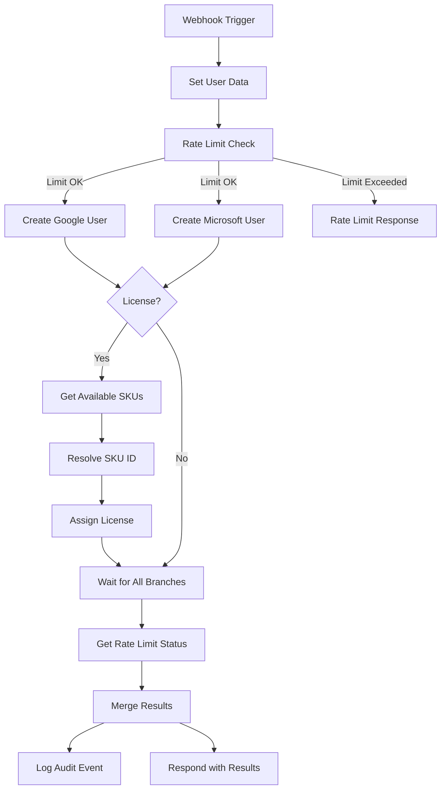

# n8n Integration (Optional)

AutoBoard works perfectly with its built-in Next.js API routes. **n8n integration is completely optional** and provides an alternative way to trigger user creation workflows.

## When to Use n8n

Consider using n8n if you:
- Want a visual workflow editor instead of modifying code
- Need to integrate with other services (Slack notifications, Google Sheets, databases)
- Prefer no-code automation tools
- Want built-in execution history and monitoring

## Quick Start

### 1. Install and Run n8n

```bash
# Using npx (recommended for testing)
npx n8n

# Or install globally
npm install -g n8n
n8n
```

n8n will start on http://localhost:5678

### 2. Import the Workflow

1. Open n8n at http://localhost:5678
2. Click **Workflows** → **Import from File**
3. Select `n8n-migration/AutoBoard.json`
4. The workflow will appear in your workspace

### 3. Configure Credentials

The workflow needs two OAuth credentials:

**Google Workspace Admin API:**
- In n8n, go to **Credentials** → **Create New**
- Select "Google Workspace Admin" or "Google Service Account"
- Follow n8n's credential setup wizard
- Required scope: `https://www.googleapis.com/auth/admin.directory.user`

**Microsoft Graph Security API:**
- In n8n, go to **Credentials** → **Create New**
- Select "Microsoft Graph Security"
- Follow n8n's OAuth2 setup wizard
- Required scopes: `User.ReadWrite.All`, `Directory.ReadWrite.All`

### 4. Set Up API Key Authentication

The workflow uses an API key to authenticate with your AutoBoard instance:

1. In your AutoBoard `.env.local`, add:
   ```
   API_KEY=your-secure-random-key-here
   ```
   Generate a secure key: `openssl rand -base64 32`

2. In n8n, update the "Check Rate Limit" and "Log Audit" nodes:
   - Set the `X-API-Key` header to match your API key
   - Update the URL to your AutoBoard instance (default: `http://localhost:3000`)

### 5. Test the Workflow

1. In n8n, click **Execute Workflow**
2. The webhook node will show a test URL
3. Send a POST request with employee data:
   ```json
   {
     "firstName": "John",
     "lastName": "Doe",
     "email": "john.doe@company.com",
     "jobTitle": "Software Engineer",
     "department": "Engineering",
     "assignLicense": true,
     "usageLocation": "US"
   }
   ```

4. Check the execution log to verify user creation

## How It Works

### Workflow Diagram



### Workflow Steps

1. **Webhook Trigger** - Receives employee data via HTTP POST
2. **Set User Data** - Normalizes and prepares user information
3. **Rate Limit Check** - Calls `/api/rate-limit/check` to prevent abuse (stops if limit exceeded, increments counter)
4. **Create Google User** - Creates user in Google Workspace (continues on error)
5. **Create Microsoft User** - Creates user in Microsoft 365 (continues on error)
6. **Get Available SKUs** - Fetches available licenses (if license assignment requested)
7. **Resolve SKU ID** - Maps license name to GUID
8. **Assign License** - Assigns Microsoft 365 license to new user
9. **Wait for All Branches** - Waits for all parallel operations to complete
10. **Get Rate Limit Status** - Calls `/api/rate-limit/status` to get final status (does NOT increment counter)
11. **Merge Results** - Combines results from both platforms and includes rate limit info
12. **Log Audit Event** - Calls `/api/audit/log` to record the action
13. **Respond with Results** - Returns success/failure status, temporary password, and rate limit status

### Security Features

The workflow integrates with AutoBoard's built-in security:

- **Rate Limiting**: Shares the same 10 users/hour limit as the web UI
- **Audit Logging**: All user creations are logged to `logs/audit.log`
- **API Key Authentication**: Prevents unauthorized workflow execution

### Rate Limit API Endpoints

AutoBoard provides two rate limit endpoints for n8n integration:

**`/api/rate-limit/check` (POST)**
- **Purpose**: Check if rate limit allows the operation AND increment the counter
- **When to use**: At the beginning of the workflow to verify quota is available
- **Behavior**: Increments the counter by 1 each time it's called
- **Returns**: `{ allowed, remaining, limit, resetAt, resetIn }` or 429 error if limit exceeded

**`/api/rate-limit/status` (POST)**
- **Purpose**: Get current rate limit status WITHOUT incrementing the counter
- **When to use**: After user creation to display current status to the user
- **Behavior**: Only reads the current state, does not modify the counter
- **Returns**: `{ remaining, limit, resetAt, resetIn }`

Both endpoints require the `X-API-Key` header for authentication.

**Important**: Always use `/check` at the start (to enforce the limit) and `/status` at the end (to show current status). Using `/check` twice will deduct 2 requests instead of 1!

## Workflow Customization

### Changing Default License

Edit the "Resolve SKU ID" node to change the default license from `O365_BUSINESS_PREMIUM`:

```javascript
const targetSku = 'YOUR_LICENSE_NAME'; // e.g., 'ENTERPRISEPACK'
```

Check your available licenses in Microsoft Admin Center → Billing → Licenses.

### Adding Notifications

n8n makes it easy to add notifications:

1. After the "Merge Results" node, add a new node
2. Select the integration you want (Slack, Email, Teams, etc.)
3. Configure the notification message using the results data

Example Slack message:
```
✅ New user created: {{ $('Set User Data').first().json.email }}
🔑 Temporary password: {{ $('Merge Results').first().json.temporaryPassword }}
```

### Configuring Rate Limit Status Display

To show users how many requests they have remaining after creating a user, configure the "Get Rate Limit Status" node:

**Node Configuration:**

1. After "Wait for All Branches" node, add an **HTTP Request** node
2. Name it "Get Rate Limit Status"
3. Configure:
   - **Method**: `POST`
   - **URL**: `http://localhost:3000/api/rate-limit/status` (use `/status`, NOT `/check`)
   - **Authentication**: None
   - **Headers**: Add header `X-API-Key` with your API key value
   - **Continue on Error**: Enable (workflow should respond even if this fails)

**Update "Merge Results" Node:**

Add rate limit info to the response by including this in your JavaScript code:

```javascript
// Get rate limit status
const rateLimitData = $('Get Rate Limit Status').first().json;

// In your return statement, add:
rateLimit: rateLimitData && !rateLimitData.error ? {
  remaining: rateLimitData.remaining,
  limit: rateLimitData.limit,
  resetAt: rateLimitData.resetAt,
  resetIn: rateLimitData.resetIn
} : null
```

This will display "X of Y requests remaining" and "Resets in Z minutes" in the frontend after user creation.

**Important**: Use `/api/rate-limit/status` (not `/check`) to avoid incrementing the counter twice!

### Adding Automatic Google Group Membership by Location

You can modify the workflow to automatically add users to specific Google Groups based on their location. Here's how to add users from Israel to the location-group@company.com group:

**Step 1: Add a Conditional Node**

1. In n8n, click the **+** button after the "Google - Create User" node
2. Select **Flow** → **If** node
3. Name it "Check Location"
4. Configure the condition:
   - **Value 1**: `={{ $node["Set User Data"].json.usageLocation }}`
   - **Operation**: `equals`
   - **Value 2**: `IL`

**Step 2: Add Google Group Membership Node**

1. Connect the **true** output of "Check Location" to a new node
2. Select **HTTP Request** node
3. Name it "Add to Location Group"
4. Configure the request:
   - **Method**: `POST`
   - **URL**: `https://admin.googleapis.com/admin/directory/v1/groups/location-group@company.com/members`
   - **Authentication**: Select your Google Workspace Admin credential
   - **Send Body**: Enable
   - **Body Content Type**: JSON
   - **JSON Body**:
     ```json
     {
       "email": "{{ $('Set User Data').first().json.email }}",
       "role": "MEMBER"
     }
     ```
5. In **Node Settings** → **Error Handling**: Enable "Continue on Error"

**Step 3: Reconnect the Workflow**

1. Connect "Add to Location Group" output to "Wait for All Branches" (input 0)
2. Connect the **false** output of "Check Location" to "Wait for All Branches" (input 0)
3. This ensures the workflow continues whether the user is from Israel or not

**Required Google Workspace Permission:**

The Google credential needs the `https://www.googleapis.com/auth/admin.directory.group` scope to manage group memberships.

**Note**: This is a custom modification specific to your organization and is not included in the generic open-source version.

### Using with Google Sheets

Instead of a webhook trigger, you can use Google Sheets as the data source:

1. Replace "Webhook Trigger" with "Google Sheets" node
2. Configure it to read new rows from your onboarding sheet
3. Set up a schedule (e.g., every 15 minutes)
4. The workflow will automatically process new employees

## Production Deployment

### Running n8n in Production

For production use, run n8n with Docker or as a service:

**Docker:**
```bash
docker run -it --rm \
  --name n8n \
  -p 5678:5678 \
  -v ~/.n8n:/home/node/.n8n \
  n8nio/n8n
```

**Docker Compose:**
```yaml
version: '3.8'
services:
  n8n:
    image: n8nio/n8n
    ports:
      - 5678:5678
    environment:
      - N8N_CORS_ORIGINS=http://localhost:3000
    volumes:
      - ~/.n8n:/home/node/.n8n
    restart: unless-stopped
```

### Environment Variables for n8n

Create a `.env` file in your n8n directory:

```bash
N8N_CORS_ORIGINS=http://localhost:3000,https://your-autoboard-domain.com
N8N_BASIC_AUTH_ACTIVE=true
N8N_BASIC_AUTH_USER=admin
N8N_BASIC_AUTH_PASSWORD=your-secure-password
```

### Activating the Workflow

1. In n8n, open the AutoBoard workflow
2. Toggle "Active" at the top right
3. The webhook will now accept real requests
4. Use the webhook URL in your forms or other integrations

## Comparison: Built-in API vs n8n

| Feature | Built-in Next.js API | n8n Workflow |
|---------|---------------------|--------------|
| **Setup Complexity** | Low (included) | Medium (requires n8n instance) |
| **Authentication** | NextAuth OAuth (user-friendly) | API key or webhook URL |
| **UI Dashboard** | ✅ Included | ❌ Separate (need to build) |
| **Customization** | Code changes required | Visual editing |
| **Integrations** | Manual coding | 400+ pre-built nodes |
| **Monitoring** | Log files | Built-in execution history |
| **Error Handling** | Code-based | Visual + "Continue on Error" |
| **Learning Curve** | Familiar to developers | Easy for non-developers |

## Troubleshooting

### Workflow returns 401 Unauthorized
- Check that the `X-API-Key` header in n8n matches your `.env.local` API_KEY
- Ensure there are no extra spaces in the header value

### Rate limit exceeded
- Both web UI and n8n share the same rate limit (10 users/hour)
- Wait for the limit to reset (shown in error message)
- Or adjust `RATE_LIMIT_MAX_REQUESTS` in `.env.local`

### Users created but not logged in audit log
- Verify `logs/audit.log` exists and has write permissions
- Check that "Log Audit Event" node is set to "Continue on Error"
- Review n8n execution log for the "Log Audit Event" node

### License assignment fails
- Ensure the SKU name in "Resolve SKU ID" matches your tenant's licenses
- Check that `usageLocation` is set correctly (required for license assignment)
- Verify the Microsoft credential has the `Directory.ReadWrite.All` scope

## When to Use Built-in API Instead

Stick with the built-in Next.js API if you:
- Want a simple, integrated solution
- Prefer OAuth-based authentication
- Don't need complex integrations
- Value having everything in one codebase
- Want to avoid running a separate n8n instance

The built-in API provides the same functionality with better integration and simpler deployment.
